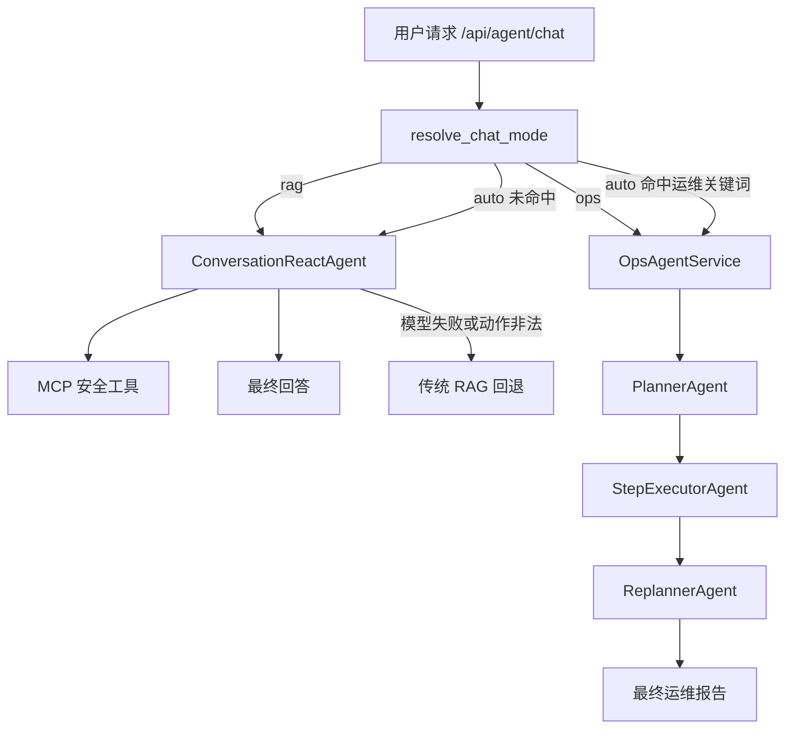
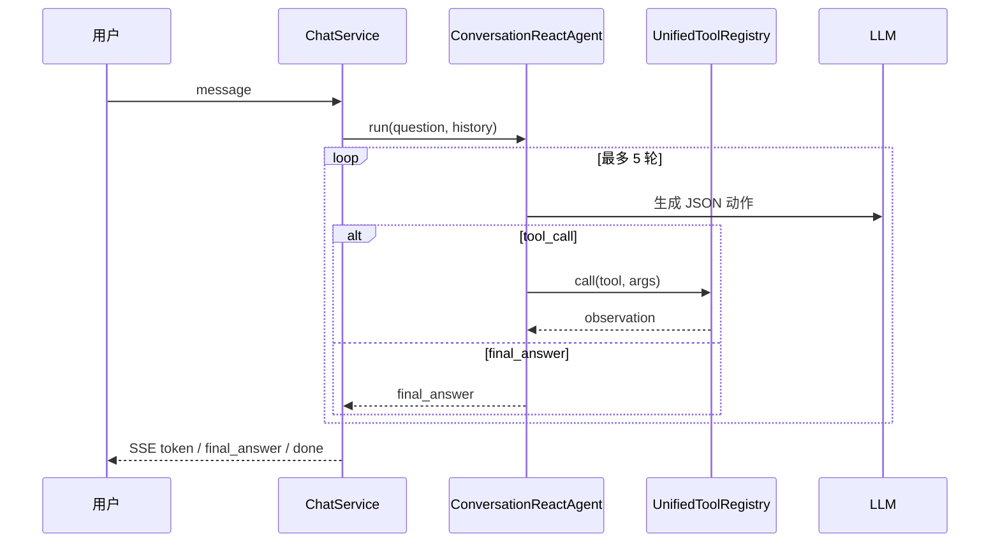
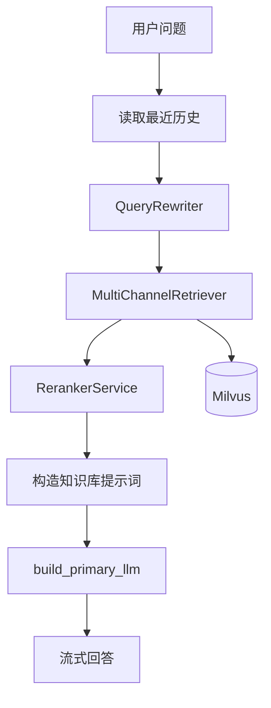
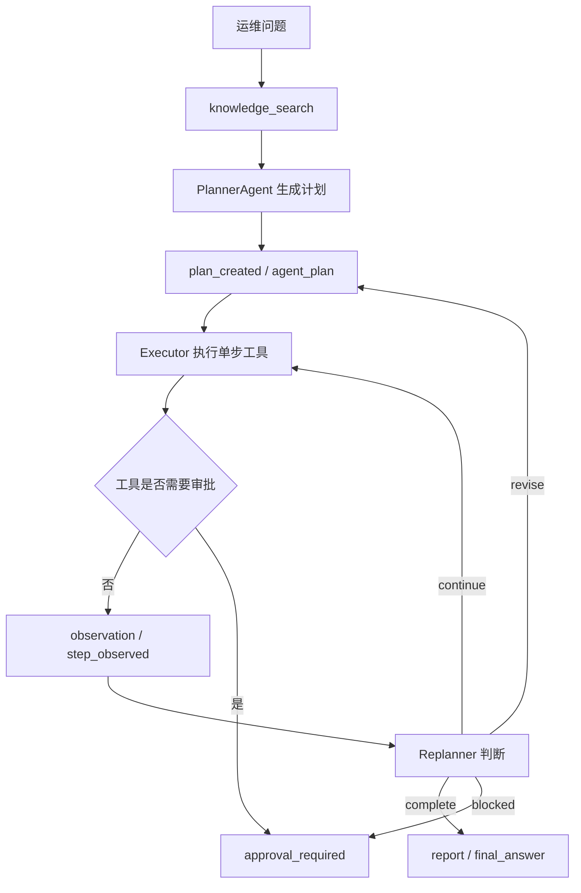
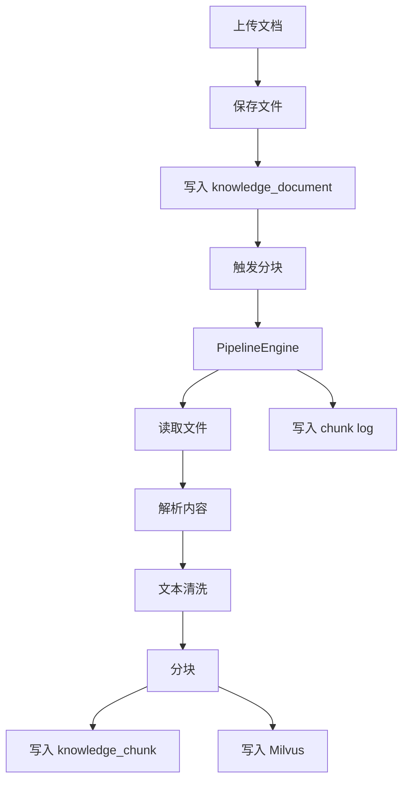
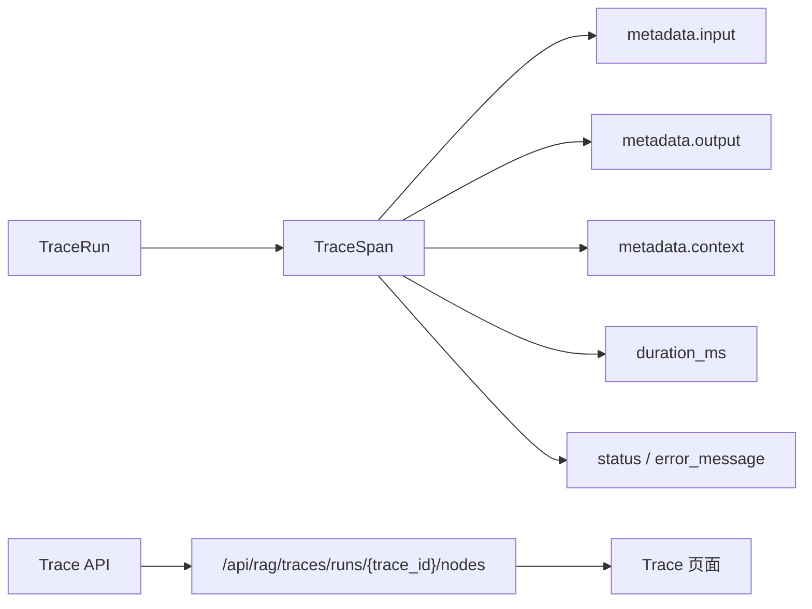
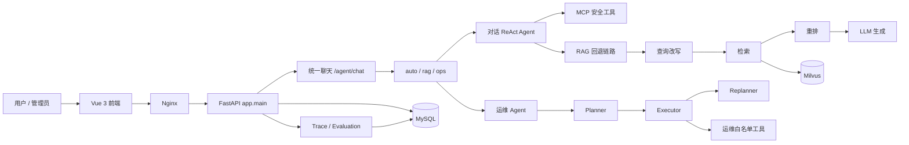

# Ragent Python

`ragent-python` 是一个以后端能力为核心的 Agentic RAG 与运维 Agent 平台，基于 `FastAPI + SQLAlchemy + MySQL + Milvus` 构建。当前后端统一在 `app/` 包下，普通对话优先走 ReAct 工具调用循环，失败时回退到传统 RAG；运维诊断走 Plan-Execute-Replan，并通过 Trace 记录关键节点、工具调用和耗时。

前端只作为最小交互入口：提供聊天页、后台管理页、Trace 查看页和运维 Agent 页面；聊天页默认只展示当前阶段和最终输出，点击“显示详情”后展开流式过程。

## 后端能力

- 统一聊天入口：`POST /api/agent/chat`，支持 `auto / rag / ops`。
- 普通对话 Agent：ReAct 优先，可调用 MCP 风格安全工具；模型或动作解析失败时回退到 RAG。
- 运维 Agent：Planner 生成计划，Executor 单步执行工具，Replanner 根据观察结果继续、完成、阻塞或修订计划。
- 统一工具层：`UnifiedToolRegistry` 合并 MCP 工具与运维白名单工具。
- 知识库：支持知识库、文档、Chunk、上传、分块、重建、启停和检索。
- 摄取流水线：`fetch -> parse -> chunk -> index` 节点化处理。
- Trace：显式记录 input、output、context、节点耗时和错误信息。
- 评估：基于 Trace、工具调用和反馈数据生成评估记录。
- 运维安全：只读工具可自动执行，写操作必须进入审批。

## 后端目录

| 目录 | 作用 |
| --- | --- |
| `app/main.py` | FastAPI 应用入口、生命周期和路由注册 |
| `app/api/routers/` | HTTP API 路由 |
| `app/core/` | 配置、数据库、时间、文本清洗等基础能力 |
| `app/domain/models.py` | SQLAlchemy ORM 模型 |
| `app/services/` | 业务服务层，包括聊天、知识库、Trace、运维和评估 |
| `app/agents/` | Agent 基础类型、ReAct、运维编排和统一工具层 |
| `app/agents/tools/` | 运维白名单工具 |
| `app/rag/` | 查询改写、检索、重排和模型工作流 |
| `app/knowledge/` | 向量库适配和知识库兼容入口 |
| `app/ingestion/` | 文档摄取流水线和节点 |
| `app/infrastructure/` | MCP、模型路由、会话记忆等基础设施 |
| `scripts/` | Windows 启动脚本和迁移/回填脚本 |

## 启动

准备 `.env`，至少包含：

```env
OPENAI_API_KEY=your-api-key
OPENAI_API_BASE=https://dashscope.aliyuncs.com/compatible-mode/v1
CHAT_MODEL=qwen-plus
DEBUG=false
SILICONFLOW_API_KEY=
MILVUS_TOKEN=
```

推荐使用脚本启动：

```powershell
scripts\start-project.bat
```

默认模式是 `ops`，会加载 `docker-compose.ops.yml`，让运维 Agent 具备 Docker 白名单工具能力。默认不强制重建镜像；修改代码后使用：

```powershell
scripts\start-project.bat -Build
```

可选模式：

```powershell
# 完整前后端，等价于 ops
scripts\start-project.bat full

# 仅后端依赖和 API，仍启用运维 override，等价于 ops-backend
scripts\start-project.bat backend

# 完整前后端，并启用运维工具
scripts\start-project.bat ops

# 仅后端，并启用运维工具
scripts\start-project.bat ops-backend
```

手动启动：

```powershell
# 完整模式
docker compose -f docker-compose.yml -f docker-compose.ops.yml --profile full up -d --build

# 仅后端依赖和 API
docker compose -f docker-compose.yml -f docker-compose.ops.yml up -d --build mysql rustfs etcd milvus redis ragent-api ops-test-service

# 停止
docker compose -f docker-compose.yml -f docker-compose.ops.yml down
```

本地后端开发：

```powershell
pip install -r requirements.txt
uvicorn app.main:app --host 0.0.0.0 --port 8000
```

## 常用地址

- 后端健康检查：`http://localhost:8000/api/health`
- 前端代理健康检查：`http://localhost/api/health`
- FastAPI 文档：`http://localhost:8000/docs`
- 前端入口：`http://localhost/`
- 聊天页：`http://localhost/chat`
- 后台首页：`http://localhost/admin/dashboard`
- Trace 页面：`http://localhost/admin/traces`
- 运维测试服务：`http://localhost:18081/`

## API 概览

核心接口保留无前缀和 `/api` 前缀两套路径，推荐外部统一使用 `/api` 前缀。

| 能力 | 接口 |
| --- | --- |
| 健康检查 | `GET /api/health` |
| 登录 | `POST /api/auth/login` |
| 统一聊天 | `POST /api/agent/chat` |
| 旧 RAG 流式聊天 | `GET /api/rag/v3/chat` |
| 停止聊天 | `POST /api/rag/v3/stop` |
| 会话列表 | `GET /api/conversations` |
| 会话消息 | `GET /api/conversations/{id}/messages` |
| 知识库列表 | `GET /api/knowledge-base` |
| 上传文档 | `POST /api/knowledge-base/{kb_id}/docs/upload` |
| 触发分块 | `POST /api/knowledge-base/docs/{doc_id}/chunk` |
| Trace 列表 | `GET /api/rag/traces/runs` |
| Trace 节点 | `GET /api/rag/traces/runs/{trace_id}/nodes` |
| 运维工具列表 | `GET /api/agent/ops/tools` |
| 运维 Agent 聊天 | `POST /api/agent/ops/chat` |
| 审批工具调用 | `POST /api/agent/ops/runs/{run_id}/approve` |

## 统一聊天

`POST /api/agent/chat`

```json
{
  "message": "检查后端日志",
  "mode": "auto",
  "conversationId": null,
  "deepThinking": false
}
```

模式：

- `auto`：根据关键词自动路由到普通 RAG 或运维 Agent。
- `rag`：强制普通对话链路。
- `ops`：强制运维 Agent 链路，要求管理员权限。

## Agent 流程图

### 统一聊天路由



### 普通对话 ReAct



### RAG 回退链路



### 运维 Plan-Execute-Replan



## 工具体系

普通用户可见工具：

| 工具 | 类型 | 说明 |
| --- | --- | --- |
| `get_time` | MCP / system | 获取当前时间 |
| `search_knowledge_base` | MCP / knowledge | 检索知识库内容 |
| `knowledge_search` | MCP / knowledge | 运维 Planner 兼容用知识检索别名 |
| `get_weather` | MCP / external | 天气占位工具 |

管理员运维额外可见工具：

| 工具 | 风险 | 是否审批 | 说明 |
| --- | --- | --- | --- |
| `compose_ps` | read | 否 | 查看 Docker Compose 服务状态 |
| `container_logs` | read | 否 | 读取容器最近日志 |
| `api_health_check` | read | 否 | 检查后端健康接口 |
| `frontend_health_check` | read | 否 | 检查前端入口 |
| `nginx_proxy_check` | read | 否 | 检查前端代理到后端是否可达 |
| `container_inspect` | read | 否 | 查看容器元信息 |
| `log_analyzer` | read | 否 | 分析容器日志中的错误模式 |
| `port_check` | read | 否 | 检查主机端口连通性 |
| `system_metrics` | read | 否 | 读取基础系统指标 |
| `container_stats` | read | 否 | 读取容器资源指标 |
| `response_time_probe` | read | 否 | 探测接口响应时间 |
| `alert_status` | read | 否 | 查看当前告警状态 |
| `metric_trend` | read | 否 | 查看指标趋势 |
| `compose_restart_service` | write | 是 | 重启指定 Compose 服务 |

安全规则：

- 运维工具只对管理员开放。
- 只读工具可自动执行。
- 写操作工具只产生审批事件，不会被 Agent 直接执行。
- 工具服务名经过白名单和别名归一化，避免模型幻觉出不可控目标。

## 知识库入库流程



## Trace 流程



Trace 当前记录：

- 输入摘要：用户问题、工具名、工具参数、事件类型。
- 输出摘要：工具结果、计划内容、重规划决策、最终报告。
- 上下文：Agent 名称等运行上下文。
- 节点耗时：Planner、工具调用、Replanner、最终回答会写入毫秒耗时。

## 系统架构图



## 前端最小说明

- 前端目录：`frontend/`
- 入口地址：`http://localhost/`
- 聊天页：`http://localhost/chat`
- 后台首页：`http://localhost/admin/dashboard`
- 聊天页默认只展示当前运行阶段和最终输出。
- 点击“显示详情”后展开 ReAct / 运维 Agent 流式过程。
- 输入框固定在屏幕底部，`Enter` 发送，`Shift + Enter` 换行。

前端本地构建：

```powershell
cd frontend
npm run build
```

仅重建前端容器：

```powershell
docker compose -f docker-compose.yml -f docker-compose.ops.yml up -d --build frontend
```

## 常用命令

```powershell
# 启动完整版本
scripts\start-project.bat

# 修改代码后强制重建并启动
scripts\start-project.bat -Build

# 查看容器状态
docker compose -f docker-compose.yml -f docker-compose.ops.yml ps

# 查看后端日志
docker compose -f docker-compose.yml -f docker-compose.ops.yml logs --tail 120 ragent-api

# 重建并重启后端
docker compose -f docker-compose.yml -f docker-compose.ops.yml up -d --build ragent-api

# 停止服务
docker compose -f docker-compose.yml -f docker-compose.ops.yml down

# 后端编译检查
python -m compileall app
```

## 故障排查

### 后端健康检查失败

```powershell
docker compose -f docker-compose.yml -f docker-compose.ops.yml ps
docker compose -f docker-compose.yml -f docker-compose.ops.yml logs --tail 120 ragent-api
```

常见原因：

- `mysql / etcd / milvus / rustfs` 未启动或非 healthy。
- `ragent-api` 启动时连不上 `mysql`。
- `.env` 中模型配置缺失或错误。

### 运维 Agent 无法调用 Docker 工具

确认启动时加载了 `docker-compose.ops.yml`：

```powershell
docker compose -f docker-compose.yml -f docker-compose.ops.yml ps
```

同时确认 API 容器环境变量和挂载：

- `AGENT_EXECUTOR_ENABLED=true`
- `AGENT_COMPOSE_PROJECT=ragent-python`
- 已挂载 `/var/run/docker.sock`

### Trace 节点耗时异常

旧 trace 可能保留历史 `0ms` 数据。新 trace 会从 Planner、工具调用、Replanner 等执行点记录真实耗时。

权威查看接口：

```text
GET /api/rag/traces/runs/{trace_id}/nodes
```

## 开发约定

- 后端重要代码注释使用简体中文。
- 新增工具必须通过统一工具注册表暴露，不允许 Agent 直接获得任意 shell 能力。
- 写操作必须标记 `requires_approval=True`。
- 外部 API 推荐统一使用 `/api` 前缀。
- 旧兼容接口仍保留，但新功能优先接入 `/api/agent/chat`。
