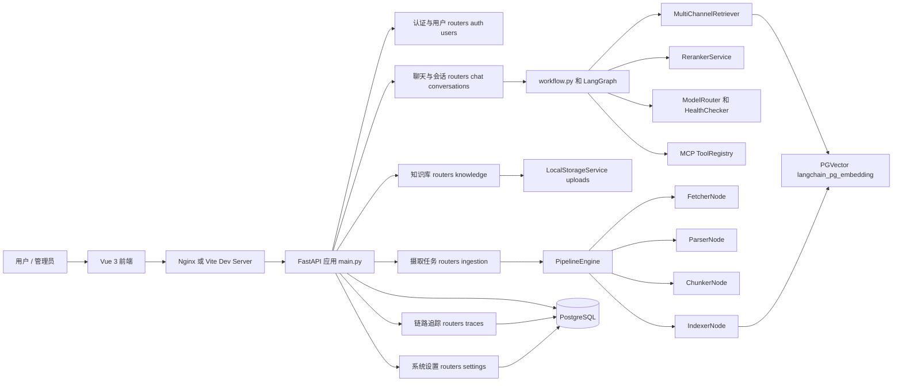
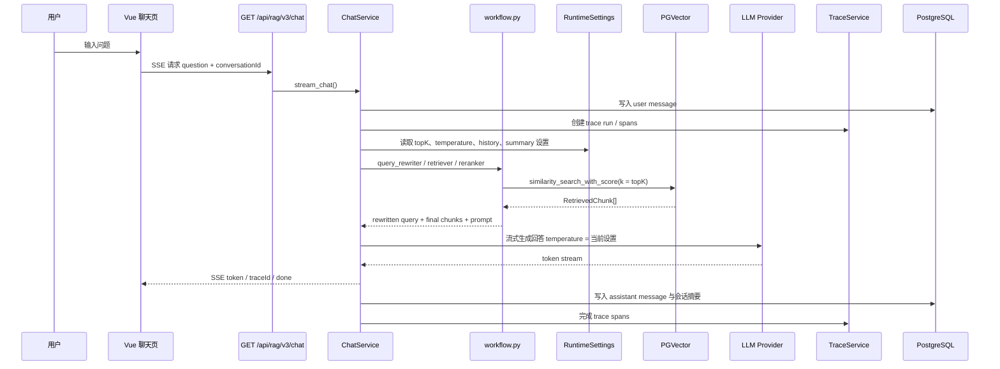
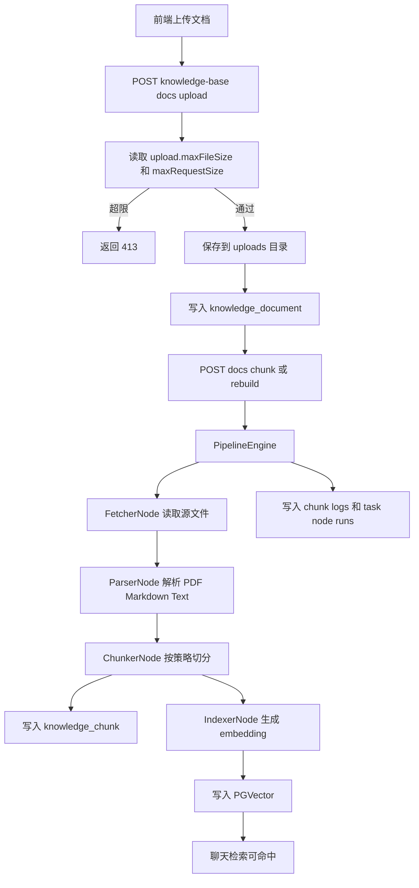
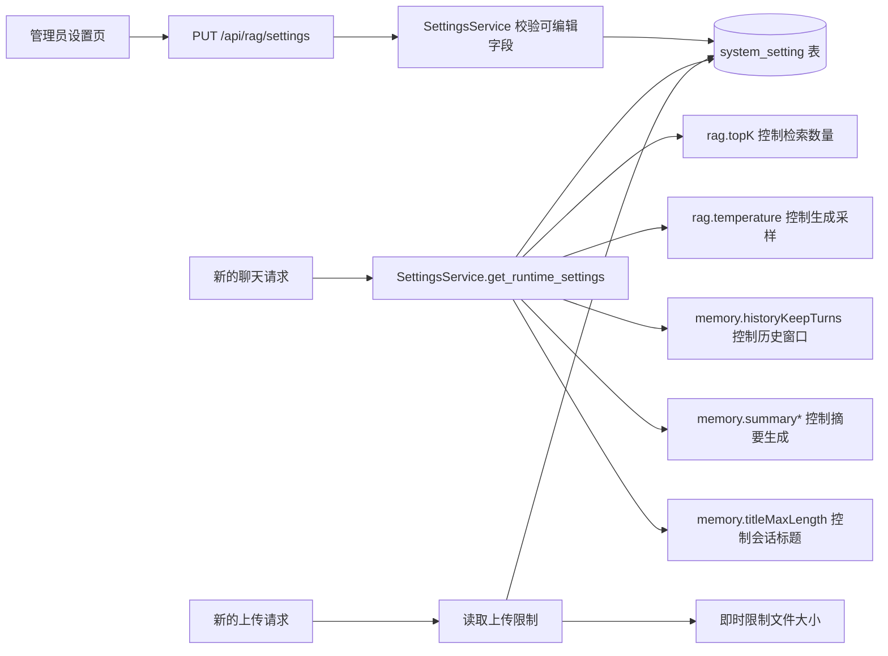
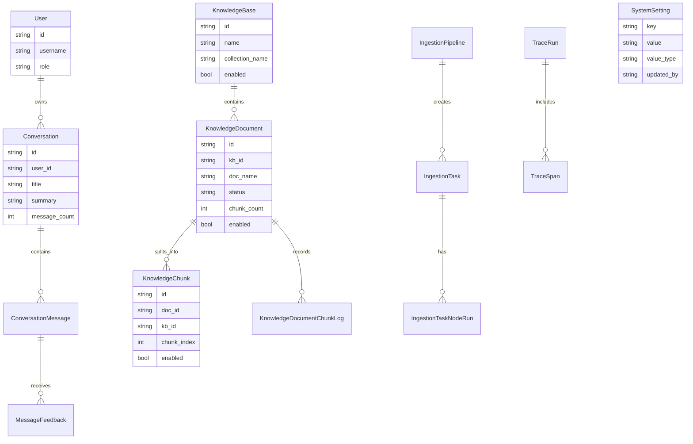

# Ragent Python — Agent 开发学习指南

Ragent Python 是一个面向 Agent 开发的实战样例仓库，组合了：
- **意图识别**
- **多分支工作流**
- **知识检索 + 向量检索**
- **查询重写**
- **工具调用（MCP）**
- **全链路 Trace 可观察性**

这个项目更适合你把 Agent 设计拆开来看，而不是只看一个“问答机器人”。

## 🎯 这个仓库适合你

如果你想学习：
- Agent 的核心控制流该怎么设计
- 如何把检索、生成、工具调用组合成一个智能体
- 如何用 `FastAPI` 建一个可扩展的 Agent 服务
- 如何让模型调用具备降级、可观测、可追踪能力

## 🚀 快速启动

### 1. 准备环境

确保已安装：
- Python 3.10+
- Docker
- Node.js（如果要运行前端）

### 2. 启动服务

```powershell
cd e:\学习\Project\Ragent\ragent-python
docker-compose up -d
```

### 3. 启动后端

```powershell
python main.py
```

### 4. 访问 API

- 文档：`http://localhost:8000/docs`
- 健康检查：`http://localhost:8000/api/health`
- 聊天接口：`http://localhost:8000/api/chat?message=你好`
- Agent 工作流接口：`http://localhost:8000/api/workflow/chat?message=公司报销流程是什么`

## 🛠️ 配置说明

配置项集中在 `config.py`，其中常用变量包括：

- `DATABASE_URL`：数据库连接
- `OPENAI_API_KEY` / `OPENAI_API_BASE`：LLM 配置
- `CHAT_MODEL`：对话模型
- `EMBEDDING_MODEL`：嵌入模型
- `COLLECTION_NAME`：向量集合名
- `DEFAULT_TOP_K`：检索数量

建议把这些变量写入 `.env` 文件。

## 🧠 Agent 核心结构

### 1. `workflow.py`

这是整个 Agent 的大脑：
- 定义 `AgentState`
- 定义各类节点函数
- 使用 `StateGraph` 构建工作流
- 通过 `route_intent` 进行条件路由

主要节点：
- `intent_analyzer_node`
- `query_rewrite_node`
- `knowledge_search_node`
- `action_call_node`
- `casual_chat_node`

### 2. 意图驱动执行

`Intent` 类型会把用户请求分成：
- `CASUAL_CHAT`
- `KNOWLEDGE_SEARCH`
- `ACTION_CALL`

根据意图，工作流会进入不同分支，这就是 Agent 的“智力判断”能力。

### 3. 多通道检索 + 重排序

`knowledge_search_node` 中会：
- 调用 `MultiChannelRetriever` 执行检索
- 使用 `RerankerService` 对结果排序
- 拼接前 K 条上下文作为 prompt
- 交给 LLM 生成答案

### 4. 工具调用（MCP）

`action_call_node` 是 Agent 的动作能力入口：
- 读取可用工具列表
- 让 LLM 选择工具与参数
- 执行工具并返回结果

### 5. 查询重写

`query_rewrite_node` 会基于历史对话和当前问题，生成更适合检索的查询，这对检索型 Agent 非常关键。

### 6. 降级与容错

`_generate_with_fallback` 会：
- 选取可用模型
- 遇到错误时记录并切换到备用模型
- 提高模型调用稳定性

## 📌 关键模块快速导航

| 模块 | 作用 |
|---|---|
| `main.py` | 应用入口、路由注册、数据库初始化、定时任务 |
| `workflow.py` | Agent 工作流核心 |
| `config.py` | 环境与参数配置 |
| `database.py` | SQLAlchemy 连接 |
| `models.py` | ORM 数据模型 |
| `vector_store.py` | 向量存储与嵌入 |
| `rag/retrieval/multi_channel_retriever.py` | 检索入口 |
| `rag/retrieval/reranker.py` | 检索结果重排 |
| `memory/session_manager.py` | 会话历史管理 |
| `mcp/tool_registry.py` | MCP 工具注册 |
| `trace/trace_collector.py` | 执行链路追踪 |
| `ingestion/pipeline_engine.py` | 文档摄取调度 |

## 📊 架构与数据流图

下面的图表使用 Mermaid 编写，GitHub、部分 IDE Markdown 预览和文档站可以直接渲染。它们描述的是当前 `ragent-python` 的主要运行链路：前端后台、FastAPI 路由、RAG 聊天、知识库入库、Trace 和运行时设置热切换。

### 1. 系统总体架构



### 2. RAG 聊天数据流



### 3. 知识库文档入库流程



### 4. 运行时设置热切换



当前支持热切换的设置项：

| 设置项 | 影响范围 | 生效方式 |
|---|---|---|
| `rag.topK` | 检索返回数量 | 新聊天请求立即生效 |
| `rag.temperature` | LLM 生成采样 | 新生成请求立即生效 |
| `memory.historyKeepTurns` | 查询重写与上下文窗口 | 新聊天请求立即生效 |
| `memory.summaryEnabled` | 会话摘要开关 | 新消息写入时立即生效 |
| `memory.summaryStartTurns` | 摘要触发阈值 | 新消息写入时立即生效 |
| `memory.summaryMaxChars` | 摘要最大长度 | 新消息写入时立即生效 |
| `memory.titleMaxLength` | 新会话标题截断 | 新会话首条消息立即生效 |
| `upload.maxFileSize` | 单文件上传限制 | 新上传请求立即生效 |
| `upload.maxRequestSize` | 单请求上传限制 | 新上传请求立即生效 |

### 5. 核心数据模型关系



### 6. 后台页面与接口关系

```mermaid
flowchart TB
    AdminLayout[AdminLayout.vue] --> Dashboard[DashboardPage.vue]
    AdminLayout --> Knowledge[KnowledgeBasePage.vue]
    AdminLayout --> IngestionPage[IngestionPage.vue]
    AdminLayout --> TracePage[TracePage.vue]
    AdminLayout --> SettingsPage[SettingsPage.vue]
    AdminLayout --> UsersPage[UsersPage.vue]
    AdminLayout --> IntentTree[IntentTreePage.vue]
    AdminLayout --> Samples[SampleQuestionPage.vue]
    AdminLayout --> Mappings[MappingPage.vue]

    Dashboard --> DashboardAPI[/admin/dashboard/*]
    Knowledge --> KnowledgeAPI[/knowledge-base*]
    IngestionPage --> IngestionAPI[/ingestion/pipelines* /ingestion/tasks*]
    TracePage --> TraceAPI[/rag/traces/runs*]
    SettingsPage --> SettingsAPI[/rag/settings]
    UsersPage --> UsersAPI[/users* /user/me]
    IntentTree --> IntentAPI[/intent-tree*]
    Samples --> SamplesAPI[/sample-questions*]
    Mappings --> MappingsAPI[/mappings*]
```

## 🎓 学习推荐顺序

1. 先读 `workflow.py`，理解 Agent 流程。
2. 了解 `Intent` 定义和 `route_intent`。
3. 看 `query_rewrite_node` 如何利用历史对话。
4. 分析 `knowledge_search_node` 的检索与生成逻辑。
5. 研究 `action_call_node` 的工具调用设计。
6. 检查 `model/model_router.py` 的模型选择与降级能力。
7. 观察 `trace/trace_collector.py` 如何埋点与调试。
8. 最后看 `ingestion/`，理解如何把文档变成向量数据。

## 📚 典型实践任务

### 任务 1：添加新意图

1. 在 `workflow.py` 扩展 `Intent`。
2. 实现新的节点函数。
3. 修改 `route_intent` 让新意图进入新分支。

### 任务 2：新增工具调用

1. 在 `mcp/tool_registry.py` 添加工具注册。
2. 让 `action_call_node` 能识别并执行该工具。
3. 在前端或 API 层增加测试入口。

### 任务 3：新增检索通道

1. 在 `rag/retrieval/multi_channel_retriever.py` 增加新通道。
2. 返回 `RetrievedChunk` 对象。
3. 检查 `knowledge_search_node` 是否正确处理新结果。

## 🚧 常用命令

```powershell
# 后端启动
python main.py

# 前端启动
cd frontend
npm install
npm run dev

# Docker 启动
docker-compose up -d
```

## 🔍 API 调试示例

```bash
curl "http://localhost:8000/api/chat?message=你好"
curl "http://localhost:8000/api/workflow/chat?message=公司的报销流程是什么"
```

## 📄 许可证

Apache 2.0
