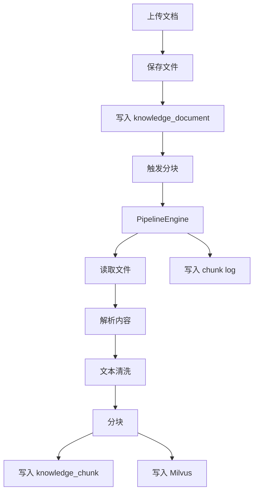
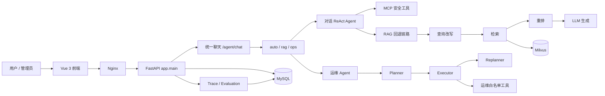

# Ragent Python

`ragent-python` 是一个基于 `FastAPI + SQLAlchemy + MySQL + Milvus + Vue 3` 的 Agentic RAG 与运维 Agent 平台。当前版本已经统一到 `app/` 后端包结构，普通对话走 ReAct 工具调用循环，运维诊断走 Plan-Execute-Replan 流程，并通过 Trace 记录关键节点、工具调用和耗时。

## 当前能力

- 统一聊天入口：`/api/agent/chat` 支持 `auto / rag / ops` 三种模式。
- 普通对话 Agent：优先走 ReAct 循环，可调用时间、知识库、天气占位等安全工具；失败时回退到传统 RAG。
- 运维 Agent：Planner 生成计划，Executor 单步执行工具，Replanner 根据观察结果决定继续、完成、阻塞或修订计划。
- 统一工具层：MCP 风格工具和运维白名单工具统一成 `UnifiedToolRegistry`。
- 知识库管理：支持知识库、文档、Chunk、上传、分块、重建、启停和检索。
- 摄取流水线：支持 fetch、parse、chunk、index 节点化处理。
- Trace 与评估：记录输入、输出、上下文、节点耗时和评估结果。
- 后台治理：登录、用户、仪表盘、系统设置、Trace 详情、评估页、运维 Agent 页面。
- Docker 化运行：包含 MySQL、RustFS、Etcd、Milvus、API、前端和运维测试服务。

## 目录结构

| 目录 | 作用 |
| --- | --- |
| `app/main.py` | FastAPI 应用入口、生命周期和路由注册 |
| `app/api/routers/` | HTTP API 路由 |
| `app/core/` | 配置、数据库、时间、文本清洗等基础能力 |
| `app/domain/models.py` | SQLAlchemy ORM 模型 |
| `app/services/` | 业务服务层，包括聊天、知识库、Trace、运维和评估 |
| `app/agents/` | Agent 基础类型、ReAct、运维编排和工具层 |
| `app/rag/` | 查询改写、检索、重排和模型工作流 |
| `app/knowledge/` | 向量库适配和知识库兼容入口 |
| `app/ingestion/` | 文档摄取流水线和节点 |
| `app/infrastructure/` | MCP、模型路由、会话记忆等基础设施 |
| `frontend/` | Vue 3 管理后台和聊天前端 |
| `scripts/` | Windows 快速启动脚本和迁移/回填脚本 |

## 快速启动

### 推荐方式：启动脚本

Windows 下直接运行：

```powershell
scripts\start-project.bat
```

默认模式是 `ops`，会启动完整前后端，并加载 `docker-compose.ops.yml`，让运维 Agent 具备 Docker 白名单工具能力。

可选模式：

```powershell
# 完整前后端，等价于 ops
scripts\start-project.bat full

# 仅后端依赖和 API，仍启用运维 override
scripts\start-project.bat backend

# 完整前后端，并启用运维工具
scripts\start-project.bat ops

# 仅后端，并启用运维工具
scripts\start-project.bat ops-backend
```

脚本会自动执行：

- 检查 Docker 是否安装和运行。
- 启动 `mysql / rustfs / etcd / milvus / ragent-api`。
- `ops` 模式额外启动 `frontend / ops-test-service`。
- 等待 `http://localhost/api/health` 返回 200。
- 输出容器状态和常用命令。

### 手动 Docker 启动

准备 `.env`，至少包含：

```env
OPENAI_API_KEY=your-api-key
OPENAI_API_BASE=https://dashscope.aliyuncs.com/compatible-mode/v1
CHAT_MODEL=qwen-plus
DEBUG=false
SILICONFLOW_API_KEY=
MILVUS_TOKEN=
```

启动完整新版本：

```powershell
docker compose -f docker-compose.yml -f docker-compose.ops.yml --profile full up -d --build
```

仅启动后端依赖和 API：

```powershell
docker compose -f docker-compose.yml -f docker-compose.ops.yml up -d --build mysql rustfs etcd milvus ragent-api ops-test-service
```

停止服务：

```powershell
docker compose -f docker-compose.yml -f docker-compose.ops.yml down
```

### 本地开发

本地开发需要自行准备 MySQL 和 Milvus：

```powershell
pip install -r requirements.txt
uvicorn app.main:app --host 0.0.0.0 --port 8000
```

前端开发：

```powershell
cd frontend
npm install
npm run dev
```

## 常用地址

- 前端：`http://localhost/`
- 后端健康检查：`http://localhost/api/health`
- FastAPI 文档：`http://localhost:8000/docs`
- 聊天页：`http://localhost/chat`
- 后台首页：`http://localhost/admin/dashboard`
- Trace 页面：`http://localhost/admin/traces`
- 运维测试服务：`http://localhost:18081/`

## 聊天与 Agent 流程

### 统一聊天入口

`POST /api/agent/chat`

请求体：

```json
{
  "message": "检查后端日志",
  "mode": "auto",
  "conversationId": null,
  "deepThinking": false
}
```

模式说明：

- `auto`：根据关键词自动路由到普通 RAG 或运维 Agent。
- `rag`：强制普通对话链路。
- `ops`：强制运维 Agent 链路，要求管理员权限。

### 普通对话链路

当前普通对话优先执行 ReAct：

```text
用户问题 -> 模型判断 -> 工具调用 -> 工具响应 -> 继续判断 -> 最终回答
```

可用工具：

- `get_time`：获取当前时间。
- `search_knowledge_base`：检索知识库内容。
- `knowledge_search`：知识库检索别名。
- `get_weather`：天气占位工具，未配置外部 API 时只返回说明。

如果模型未返回合法 ReAct 动作或模型调用失败，会回退到传统 RAG：

```text
历史上下文 -> 查询改写 -> 多通道检索 -> 重排 -> 提示词构造 -> 流式生成
```

### 运维 Agent 链路

当前运维链路是 Plan-Execute-Replan：

```text
用户问题
  -> Planner 查询知识库并生成计划
  -> Executor 单步调用工具
  -> Replanner 判断完成、继续、阻塞或修订计划
  -> 最终运维报告
```

SSE 事件主要包括：

- `run_created`
- `orchestrator_start`
- `tool_call`
- `observation`
- `plan_created`
- `agent_plan`
- `step_started`
- `step_observed`
- `replan_decision`
- `approval_required`
- `report`
- `final_answer`
- `done`

## 工具清单

普通用户可见工具：

| 工具 | 类型 | 说明 |
| --- | --- | --- |
| `get_time` | MCP / system | 获取当前时间 |
| `search_knowledge_base` | MCP / knowledge | 检索知识库内容 |
| `knowledge_search` | MCP / knowledge | 运维 Planner 兼容用知识检索别名 |
| `get_weather` | MCP / external | 天气占位工具 |

管理员运维额外可见工具：

| 工具 | 风险 | 是否审批 | 说明 |
| --- | --- | --- | --- |
| `compose_ps` | read | 否 | 查看 Docker Compose 服务状态 |
| `container_logs` | read | 否 | 读取容器最近日志 |
| `api_health_check` | read | 否 | 检查后端健康接口 |
| `frontend_health_check` | read | 否 | 检查前端入口 |
| `nginx_proxy_check` | read | 否 | 检查前端代理到后端是否可达 |
| `container_inspect` | read | 否 | 查看容器元信息 |
| `log_analyzer` | read | 否 | 分析容器日志中的错误模式 |
| `port_check` | read | 否 | 检查主机端口连通性 |
| `system_metrics` | read | 否 | 读取基础系统指标 |
| `container_stats` | read | 否 | 读取容器资源指标 |
| `response_time_probe` | read | 否 | 探测接口响应时间 |
| `alert_status` | read | 否 | 查看当前告警状态 |
| `metric_trend` | read | 否 | 查看指标趋势 |
| `compose_restart_service` | write | 是 | 重启指定 Compose 服务 |

安全规则：

- 运维工具只对管理员开放。
- 只读工具可自动执行。
- 写操作工具只产生审批事件，不会被 Agent 直接执行。
- 工具服务名经过白名单和别名归一化，避免模型幻觉出不可控目标。

## API 概览

核心接口按模块注册，同时保留无前缀和 `/api` 前缀两套路径。推荐外部统一使用 `/api` 前缀。

| 能力 | 接口 |
| --- | --- |
| 健康检查 | `GET /api/health` |
| 登录 | `POST /api/auth/login` |
| 统一聊天 | `POST /api/agent/chat` |
| 旧 RAG 流式聊天 | `GET /api/rag/v3/chat` |
| 停止聊天 | `POST /api/rag/v3/stop` |
| 会话列表 | `GET /api/conversations` |
| 会话消息 | `GET /api/conversations/{id}/messages` |
| 知识库列表 | `GET /api/knowledge-base` |
| 上传文档 | `POST /api/knowledge-base/{kb_id}/docs/upload` |
| 触发分块 | `POST /api/knowledge-base/docs/{doc_id}/chunk` |
| Trace 列表 | `GET /api/rag/traces/runs` |
| Trace 节点 | `GET /api/rag/traces/runs/{trace_id}/nodes` |
| 运维工具列表 | `GET /api/agent/ops/tools` |
| 运维 Agent 聊天 | `POST /api/agent/ops/chat` |
| 审批工具调用 | `POST /api/agent/ops/runs/{run_id}/approve` |

## Trace 与评估

Trace 当前会记录：

- 输入摘要：用户问题、工具名、工具参数、事件类型。
- 输出摘要：工具结果、计划内容、重规划决策、最终报告。
- 上下文：Agent 名称等运行上下文。
- 节点耗时：Planner、工具调用、Replanner、最终回答会写入真实毫秒耗时。

权威查看接口：

```text
GET /api/rag/traces/runs/{trace_id}/nodes
```

如果旧 trace 里节点耗时为 `0ms`，通常是历史数据；新运行会记录真实耗时。

## 知识库入库流程



## 系统架构



## 常用命令

```powershell
# 使用脚本启动完整新版本
scripts\start-project.bat

# 查看容器状态
docker compose -f docker-compose.yml -f docker-compose.ops.yml ps

# 查看后端日志
docker compose -f docker-compose.yml -f docker-compose.ops.yml logs --tail 120 ragent-api

# 重建并重启后端
docker compose -f docker-compose.yml -f docker-compose.ops.yml up -d --build ragent-api

# 停止服务
docker compose -f docker-compose.yml -f docker-compose.ops.yml down

# 后端编译检查
python -m compileall app

# 前端构建
cd frontend
npm run build
```

## 故障排查

### 后端健康检查失败

先看容器状态：

```powershell
docker compose -f docker-compose.yml -f docker-compose.ops.yml ps
```

常见原因：

- `mysql / etcd / milvus / rustfs` 未启动或非 healthy。
- `ragent-api` 启动时连不上 `mysql`。
- `.env` 中模型配置缺失或错误。

查看日志：

```powershell
docker compose -f docker-compose.yml -f docker-compose.ops.yml logs --tail 120 ragent-api
```

### 前端 502

前端 502 通常是后端不可用或 Nginx 无法解析 `ragent-api`。先确认：

```powershell
Invoke-WebRequest http://localhost/api/health -UseBasicParsing
```

### 运维 Agent 无法调用 Docker 工具

检查是否使用了 `docker-compose.ops.yml`：

```powershell
docker compose -f docker-compose.yml -f docker-compose.ops.yml ps
```

同时确认 API 容器环境变量：

- `AGENT_EXECUTOR_ENABLED=true`
- `AGENT_COMPOSE_PROJECT=ragent-python`
- 已挂载 `/var/run/docker.sock`

### Trace 节点耗时异常

旧 trace 可能保留历史 `0ms` 数据。新 trace 的运维节点会从实际 Planner、工具调用、Replanner 执行点记录耗时。

验证接口：

```text
GET /api/rag/traces/runs/{trace_id}/nodes
```

## 开发约定

- 后端重要代码注释使用简体中文。
- 新增工具必须通过统一工具注册表暴露，不允许 Agent 直接获得任意 shell 能力。
- 写操作必须标记 `requires_approval=True`。
- 外部 API 推荐统一使用 `/api` 前缀。
- 旧兼容接口仍保留，但新功能优先接入 `/api/agent/chat`。

## 版本说明

当前 README 描述的是新版本后端核心：

- 普通聊天：ReAct 优先，RAG 回退。
- 运维诊断：Plan-Execute-Replan。
- 工具层：MCP 工具与运维工具统一注册。
- Trace：显式区分 input/output/context，并记录真实节点耗时。
