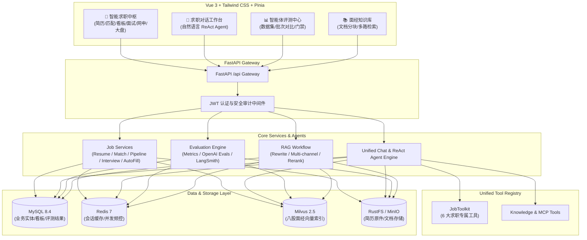

# Ragent Python - 智能求职 Agent 平台 (NowClaw 对齐与大模型测评体系)

`ragent-python` 是一个以全链路求职智能化为核心的 **AI 智能求职 Agent 与大模型测评平台**（对齐牛客 NowClaw 架构体系），基于 `FastAPI + SQLAlchemy + MySQL/SQLite + Milvus + Vue3 + Tailwind CSS` 构建。

平台集成了 **智能简历中枢、岗位检索与人岗精准匹配、求职投递看板、AI 沉浸式模拟面试厅、网申自动填表 Bridge 协议、大模型/智能体评测中心 (Evaluations) 与八股面经知识库 RAG**，全流程赋能求职者高效拿 Offer，同时为智能体研发提供完整的评估基准与回归门禁。

## 🔐 真实招聘平台验收边界

Ragent 不保存 BOSS直聘、猎聘、51job 或牛客网的用户名和密码。真实平台能力依赖用户手动启动并登录本地 Chrome CDP Profile：

```powershell
& "C:\Program Files\Google\Chrome\Application\chrome.exe" --remote-debugging-port=9223 --user-data-dir="C:\ragent-chrome"
```

可使用以下脚本检查 CDP 是否可访问及平台标签页是否存在：

```powershell
.\scripts\verify-real-platforms.ps1
```

只有 `scripts/verify-real-platforms.py` 对四个平台都返回 `status: "verified"` 时，才可以宣称真实搜索、详情采集、登录态及无风控验收完成。没有 CDP 会话时脚本必须失败，并且不能使用静态岗位替代。


1. **智能简历中枢 (Resume Intelligence & STAR Polishing)**
   - 简历多格式智能解析（PDF/Word/Markdown/文本），大模型多维度结构化提取（基本信息、教育经历、工作经历、项目经历、专业技能、荣誉证书）。
   - 简历多版本定制管理（针对不同岗位方向派生版本），AI 质量评分卡（完整度、清晰度、量化成果、契合度）与痛点诊断建议。
   - **STAR 法则智能润色重构**（情境 S、任务 T、行动 A、结果 R 量化，突出底层架构原理与核心收益）。

2. **岗位检索与人岗精准匹配 (Job Match Engine)**
   - 多渠道岗位机会聚合检索（牛客网申、BOSS直聘、校招/社招岗位库）。
   - 深度全维度人岗匹配打分算法（0-100 综合分、必备技能与加分项比对、核心竞争优势、短板缺口与补强建议）。
   - **一键生成高情商破冰打招呼话术与专属求职信 (Cover Letter)**。

3. **求职投递看板 (Application Pipeline & Kanban)**
   - 可视化 Kanban 流水线全生命周期管理：`意向岗位 -> 已网申 -> 简历初筛 -> 笔试测评 -> 一面/二面/HR面 -> 斩获Offer -> 归档`。
   - 阶段拖拽流转、面试日程记录、面试复盘笔记、录用 Offer 薪资包详情与入职决策分析。

4. **AI 沉浸式模拟面试厅 (Mock Interview Room)**
   - 多角色面试官设定（大厂技术专家、架构师/技术总监、资深 HRBP、骨干研发）。
   - 针对目标岗位 JD 与候选人简历的动态多轮沉浸式提问（技术八股、项目深挖、高并发系统设计、行为面试 BQ）。
   - 实时作答大模型评测打分、采分点覆盖分析、大厂标准示范回答 (Model Answer) 对比与五维能力雷达图复盘报告。

5. **网申助手与自动填表 (Auto-Fill & Bridge Protocol)**
   - 严格对齐 NowClaw 浏览器扩展与 Bridge 通信规范（`fill.state` 协议）。
   - 将结构化简历自动映射为各招聘平台的标准填表 Payload，支持一键复制与插件桥接。

6. **求职数据分析大盘 (Job Analytics Dashboard)**
   - 全周期投递转化漏斗分析、面试通过率、Offer 转化率、能力成长曲线与求职策略周报。

7. **求职专用 ReAct Agent 与工具箱 (`JobToolkit`)**
   - 统一工具注册表集成 `job_parse_resume`, `job_optimize_project_star`, `job_search_postings`, `job_match_analysis`, `job_generate_interview_questions`, `job_generate_greeting` 等 6 大求职专有工具，对话台支持自然语言一站式调度。

---

## 📊 大模型与智能体测评体系 (Evaluations)

平台配备了企业级大模型与智能体评测体系，支持自动化评估、数据集批次对比、回归门禁与外部评测平台深度集成：

1. **评测数据集管理 (Datasets & Testcases)**：支持构建面经问答、人岗匹配、简历润色、代码能力等多领域黄金测试集。
2. **批次对比评测 (Batch Runs & Regression Gating)**：支持候选模型与基线批次对比，自动计算准确率、召回率、BLEU、ROUGE 与结构化采分率。
3. **OpenAI Evals 深度集成**：支持将智能体评测数据集一键同步至 OpenAI Evals 规范并执行评测打分。
4. **LangSmith 链路追踪集成**：支持全链路 Trace 上报、延迟分析与自动化指标回传。

---

## 🏗️ 系统架构设计


```mermaid
flowchart TD
    subgraph 前端交互层 [Vue 3 + Tailwind CSS + Pinia]
        UI1["🎯 智能求职中枢\n(简历/匹配/看板/面试/网申/大盘)"]
        UI2["💬 求职对话工作台\n(自然语言 ReAct Agent)"]
        UI3["📊 智能体评测中心\n(数据集/批次对比/门禁)"]
        UI4["📚 面经知识库\n(文档分块/多路检索)"]
    end

    subgraph 网关与路由层 [FastAPI Gateway]
        GW["FastAPI /api Gateway"]
        AuthMid["JWT 认证与安全审计中间件"]
    end

    subgraph 智能体与核心服务层 [Core Services & Agents]
        JobService["Job Services\n(Resume / Match / Pipeline / Interview / AutoFill)"]
        ChatEngine["Unified Chat & ReAct Agent Engine"]
        EvalEngine["Evaluation Engine\n(Metrics / OpenAI Evals / LangSmith)"]
        RAGEngine["RAG Workflow\n(Rewrite / Multi-channel / Rerank)"]
    end

    subgraph 工具注册表 [Unified Tool Registry]
        JT["JobToolkit\n(6 大求职专属工具)"]
        KT["Knowledge & MCP Tools"]
    end

    subgraph 存储与基础设施 [Data & Storage Layer]
        MySQL[("MySQL 8.4\n(业务实体/看板/评测结果)")]
        Redis[("Redis 7\n(会话缓存/并发频控)")]
        Milvus[("Milvus 2.5\n(八股面经向量索引)")]
        RustFS[("RustFS / MinIO\n(简历原件/文档存储)")]
    end

    UI1 & UI2 & UI3 & UI4 --> GW
    GW --> AuthMid
    AuthMid --> JobService & ChatEngine & EvalEngine & RAGEngine
    ChatEngine --> JT & KT
    JobService & ChatEngine & EvalEngine & RAGEngine --> MySQL & Redis & Milvus & RustFS
```

---

## 📁 项目目录结构

```text
ragent-python/
├── app/
│   ├── agents/                  # ReAct 智能体编排、工具注册表与工具定义
│   │   ├── tools/
│   │   │   └── job_toolkit.py   # 6 大求职专有工具实现 (NowClaw 对齐)
│   │   ├── react_agent.py       # 对话 ReAct 循环引擎
│   │   └── tool_registry.py     # 统一工具注册表 (UnifiedToolRegistry)
│   ├── api/routers/             # HTTP API 路由层
│   │   ├── job_resumes.py       # 简历中枢 API
│   │   ├── job_matching.py      # 岗位与人岗匹配 API
│   │   ├── job_applications.py  # 投递看板流水线 API
│   │   ├── mock_interviews.py   # AI 模拟面试厅 API
│   │   ├── job_autofill.py      # 网申自动填表 API
│   │   ├── evaluations.py       # 智能体评估与测评中心 API
│   │   ├── unified_chat.py      # 统一求职对话 API
│   │   ├── knowledge.py         # 八股面经知识库 API
│   │   ├── trace.py             # 链路追踪 API
│   │   └── security_audit.py    # 安全审计 API
│   ├── core/                    # 配置、数据库会话、安全头与工具函数
│   ├── domain/models.py         # SQLAlchemy 领域实体定义 (求职/评测/知识库)
│   ├── infrastructure/          # MCP 客户端、模型路由与多模型适配
│   ├── ingestion/               # 知识库文档摄取与 ETL 流水线
│   ├── rag/                     # 查询重写、多路召回 (向量+BM25)、RRF 融合与重排
│   ├── services/                # 业务服务层
│   │   ├── job_resume_service.py
│   │   ├── job_matching_service.py
│   │   ├── job_application_service.py
│   │   ├── mock_interview_service.py
│   │   ├── job_auto_fill_service.py
│   │   ├── evaluation_service.py
│   │   └── unified_chat_service.py
│   └── main.py                  # FastAPI 主入口与生命周期管理
├── frontend/                    # Vue3 + Tailwind CSS 前端工程
│   ├── src/
│   │   ├── pages/job/           # 6 大求职核心页面
│   │   │   ├── ResumeCenterPage.vue
│   │   │   ├── JobMatchingPage.vue
│   │   │   ├── JobKanbanPage.vue
│   │   │   ├── MockInterviewPage.vue
│   │   │   ├── JobAutoFillPage.vue
│   │   │   └── JobDashboardPage.vue
│   │   ├── pages/EvaluationPage.vue  # 智能体评测中心页面
│   │   ├── pages/ChatPage.vue        # 求职对话工作台
│   │   └── router.ts                 # 前端路由配置
│   └── package.json
├── tests/                       # 自动化单测套件 (求职/评测/安全)
│   ├── test_job_agent_full.py
│   ├── test_evaluation_hybrid.py
│   ├── test_agent_eval_service.py
│   ├── test_openai_evals_service.py
│   └── test_langsmith_integration.py
├── docker-compose.yml           # 容器化编排 (MySQL+Redis+Milvus+RustFS+API+Frontend)
├── requirements.txt             # 后端 Python 依赖清单
└── .env.example                 # 环境变量示例
```

---

## 🚀 快速启动

### 1. 环境准备

复制环境变量示例配置：

```powershell
copy .env.example .env
```

在 `.env` 中填入你的大模型 API 配置（支持通义千问、DeepSeek、OpenAI、SiliconFlow 等兼容接口）：

```env
OPENAI_API_KEY=your-api-key
OPENAI_API_BASE=https://dashscope.aliyuncs.com/compatible-mode/v1
CHAT_MODEL=qwen-plus
EMBEDDING_MODEL=text-embedding-v3
```

### 2. Docker Compose 一键启动 (推荐)

使用项目提供的启动脚本，一键拉起完整前后端与存储底座：

```powershell
# Windows
scripts\start-project.bat

# 修改代码后强制重新构建镜像并启动
scripts\start-project.bat -Build
```

或使用原生 Docker Compose 命令：

```powershell
# 启动全栈服务（含 Nginx 前端与后端所有存储组件）
docker compose --profile full up -d --build
```

### 3. 本地独立开发启动

**后端启动**：
```powershell
# 创建并激活虚拟环境
python -m venv venv
.\venv\Scripts\activate

# 安装依赖
pip install -r requirements.txt

# 启动 FastAPI 服务
uvicorn app.main:app --host 0.0.0.0 --port 8000 --reload
```

**前端启动**：
```powershell
cd frontend
npm install
npm run dev
```

---

## 🌐 访问地址与默认账号

- **前端控制台入口**：`http://localhost/` 或 `http://localhost:5173/`
- **求职智能对话台**：`http://localhost/chat`
- **智能简历中枢**：`http://localhost/admin/resumes`
- **岗位与人岗匹配**：`http://localhost/admin/job-matching`
- **求职投递看板**：`http://localhost/admin/job-kanban`
- **AI 模拟面试厅**：`http://localhost/admin/mock-interviews`
- **网申自动填表**：`http://localhost/admin/job-autofill`
- **智能体评测中心**：`http://localhost/admin/evaluations`
- **八股面经知识库**：`http://localhost/admin/knowledge`
- **FastAPI 接口文档 (Swagger)**：`http://localhost:8000/docs`

**默认管理员账号**：
- 用户名：`admin`
- 密码：`admin123`（可在 `.env` 中通过 `DEFAULT_ADMIN_PASSWORD` 自定义）

---

## 🔌 API 核心接口速查

| 业务分类 | 接口路径 | 请求方式 | 说明 |
| :--- | :--- | :---: | :--- |
| **简历中枢** | `/api/jobs/resumes` | `GET` | 获取当前用户的简历列表 |
| | `/api/jobs/resumes/parse` | `POST` | 智能解析原始简历文本并诊断 |
| | `/api/jobs/resumes/star-polish` | `POST` | 基于 STAR 法则优化项目经历 |
| | `/api/jobs/resumes/{id}/versions` | `POST` | 为目标岗位创建针对性简历版本 |
| **岗位与匹配** | `/api/jobs/postings` | `GET` | 检索岗位机会列表 |
| | `/api/jobs/matching/analyze` | `POST` | 深度全维度人岗匹配打分 |
| | `/api/jobs/matching/greeting` | `POST` | 生成 HR 高情商破冰与求职信 |
| **投递看板** | `/api/jobs/applications` | `GET` | 获取投递全阶段看板数据 |
| | `/api/jobs/applications` | `POST` | 新增投递跟进记录 |
| | `/api/jobs/applications/{id}/stage` | `PUT` | 流转投递阶段（一面/二面/Offer） |
| **模拟面试** | `/api/jobs/interviews/sessions` | `POST` | 创建针对岗位的模拟面试会话 |
| | `/api/jobs/interviews/sessions/{id}/question`| `POST` | 生成下一轮面试官提问 |
| | `/api/jobs/interviews/records/{id}/evaluate` | `POST` | 评估候选人回答并给出评分与示范 |
| | `/api/jobs/interviews/sessions/{id}/finish` | `POST` | 结束面试并生成五维复盘雷达图报告 |
| **网申自动填表** | `/api/jobs/autofill/mappings` | `GET` | 获取各平台 Bridge 字段映射规则 |
| | `/api/jobs/autofill/payload` | `POST` | 生成用于插件自动填表的标准化 Payload |
| **智能体测评** | `/api/admin/evaluations/datasets` | `GET/POST` | 测评数据集管理 |
| | `/api/admin/evaluations/datasets/{id}/runs` | `POST` | 触发全量测试用例评测批次 |
| | `/api/admin/evaluations/batch-runs` | `GET` | 获取评测历史与准确率/召回率对比 |
| **对话与问答** | `/api/agent/chat` | `POST` | 智能求职 ReAct Agent 与 RAG 流式对话 |

---

## 🧪 自动化测试与质量保障

项目拥有完善的自动化测试套件，全面覆盖求职全链路、大模型评测、OpenAI Evals、LangSmith 回传与安全合规体系：

```powershell
# 运行全部自动化测试 (106 项测试)
pytest

# 仅运行智能求职核心与测评测试
pytest tests/test_job_agent_full.py tests/test_evaluation_hybrid.py tests/test_agent_eval_service.py tests/test_openai_evals_service.py
```

测试执行结果：
```text
============================ 106 passed in 57.55s =============================
```

---

## 📄 License

本项目基于 [Apache 2.0 License](LICENSE) 开源发布。
